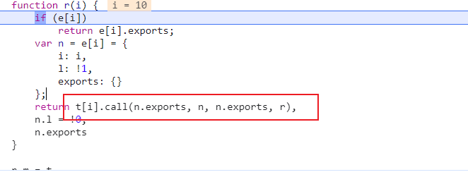
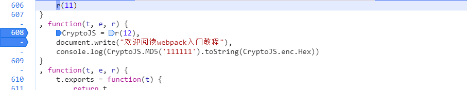
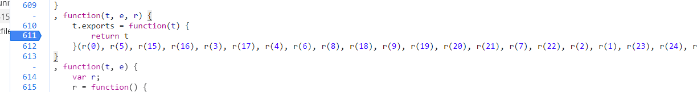
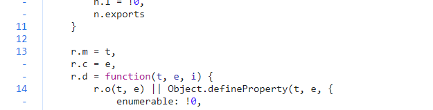
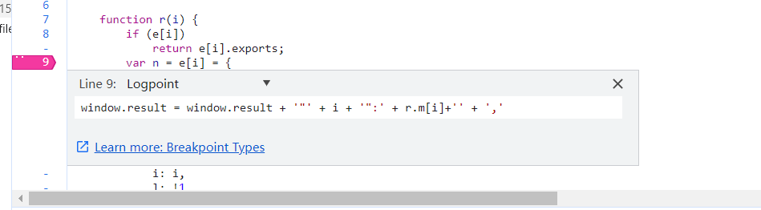

#                                 webpack 原理

> 目前市场上主要有webpack3、webpack4、webpack5这几种打包方式，其中webpack4时最常见
>
> 注意：webpack是一种打包工具，可以勉强理解为是一种壳。所以，webpack本身并不会影响到任何的混淆。

## 一、webpack 做了什么事情

* 以加载器为核心，以加载器调用某一个模块为入口，分模块打包，最终返回 `*.exports` 进行调用的一种打包工具

    * 加载器
    
    ```
    function r(i) {
        if (e[i])
            return e[i].exports;
        var n = e[i] = {
            i: i,
            l: !1,
            exports: {}
        };
        return t[i].call(n.exports, n, n.exports, r),
        n.l = !0,
        n.exports
    }
    ```
    
    * 入口: <font color=red>(r(10))</font>



* 模块
    *   webpack的自执行函数里面传入的参数，这个参数可以时数组、对象
* 加载器最终返回的是什么
    * 返回的是一个 `*.exports` 对象

## 二、webpack 如何半自动抠代码

### 1. 拿到加载器代码

网页初始化之后在任何地方，只要有加载器的位置·`类似与这中r(10), r(11)`·下一个断点，在断点处然后把函数取出来；
>有两种方式取出来：
>	方式1：在控制台把`r `函数打印出来，然后鼠标左键点击就能进入到函数 
>	方式2：鼠标悬停在`r`函数上，鼠标点击[FunctionLocation]就能跳转到`r`函数

### 2. 获取所有加载的模块

它执行的过程是这样：
<font color=red>业务代码r(1)-r(20)... --> (--从代码执行到函数入口开始 > r(5)-r(10)-r(12)... > 代码拿到密文结束) --> 业务代码r(1)-r(16)...</font>
我们要做的就是从代码执行到函数入口开始一直到代码拿到密文结束这个过程中加载的模块`r(5)-r(10)-r(12)...`全都弄到本地。

1) 暂时在函数代码执行入口处下断点以及代码拿到密文结束

​	

注意：**下断点时注意函数出口的断点位置，可能会导致缺失模块的错误(比如下面这种情况)，就需要在堆栈中找前一个模块，把这个模块做为函数入口**

​    

2. 进入到`r`函数里面插入一段代码(断点)来获取所有加载的模块，在插入代码之前定义一个变量来用于接收所有模块

​    

```
window.result = '';             // 控制台创建一个变量来接收加载的所有模块

// 拼接成我们想要的格式, 也可以从toString中去获取函数
// 从 r.m[0].toString 这种方式也可以去获取模块，因为加载器模块把t赋值给了r.m 
window.result = window.result + '"' + i + '":' + t[i]+'' + ','       
```

​        

​		在加载器的 `if`条件判断之后插入代码，避免重复加载模块。

		3.  最后通过`copy(window.result)`复制到本地

### 半自动扣取代码的弊端

```
1. webpack只是打包工具，环境检测，浏览器指纹，各种信息收集都需要自己处理
2. 投毒不易被发现
3. 如果有反爬，需要额外处理，它只是缩减了需要处理的内容
   
所以，webpack + 检测 + 混淆  是一种非常常见的组合手段
```


