## 一、目标: 让本地的node.js 执行结果与浏览器的这两个参数一致即可

> 1.请求参数: yrx15=c735b8e2e1a9fe9c22ea566d1869ca89
> 2.请求头: Yrx-15-Jsvmp: 2040452881.c2d1061cd162303487b6c5a518bb7287bf59826e10cf86a0dcae524caa0c1957.1690435186815

*******************************************************************************

## 二、步骤拆解：

### 1)准备工作

将所有代码放到本地，利用AutoResponder拦截请求重定向到本地资源，
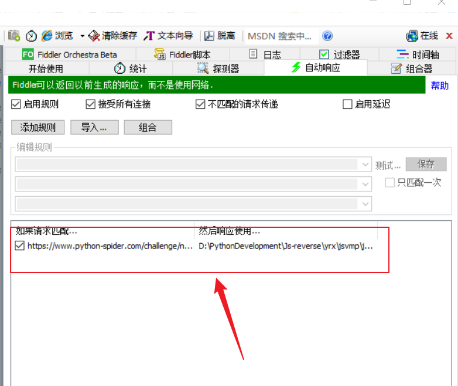

### 2)为了方便跟踪，先hook住浏览器的时间和随机数

```javascript
Date.prototype.getTime = function(){
    return 1690435186814
};
Math.random = function (){
    return 0.22283564695768754
};
```

将代码在本地node.js环境跑一下，发现什么都没有。。。

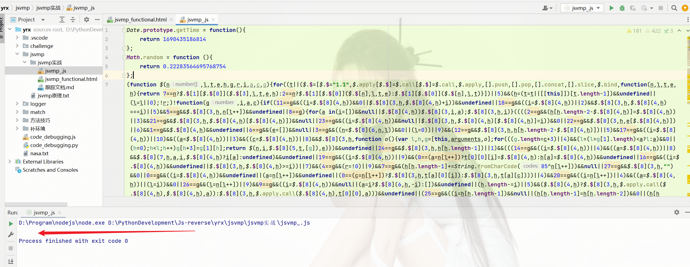

猜测逻辑都没有执行，代码都没有调用。。。

### 3)jsvmp逆向标准流程

> 找到对应接口—>找来源(xhr断点、常规跟值、Request call stack(Initiator))

找到代码的执行入口，控制台打印的时候发现它请求的时候自动就把参数加上了，
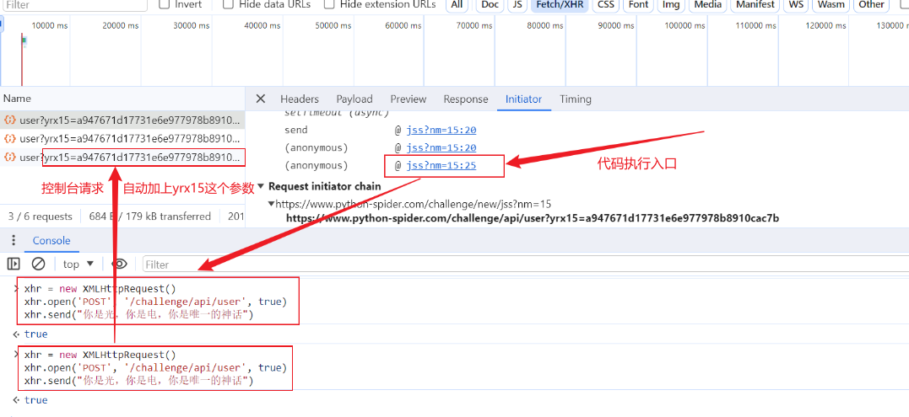
很有可能`open、send`方法被重写了，拿悬停大法验证一下, 可以看到不是一个内置函数
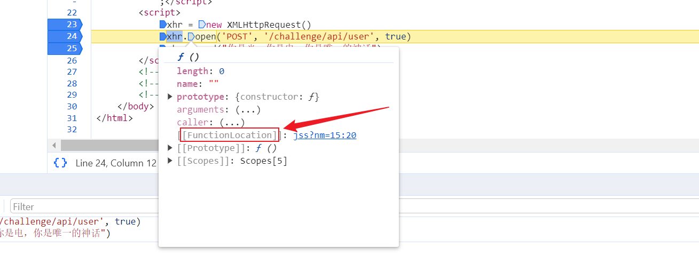

由于XMLHttpRequest构造函数也被重写了，正常来说我们应该从这里下断，一步一步跟。因为我们主要是了解jsvmp插桩的思路，所以直接跟下`send`方法，然后追堆栈。。。

到这里鼠标选中看下返回值就是我们主要处理的函数了，

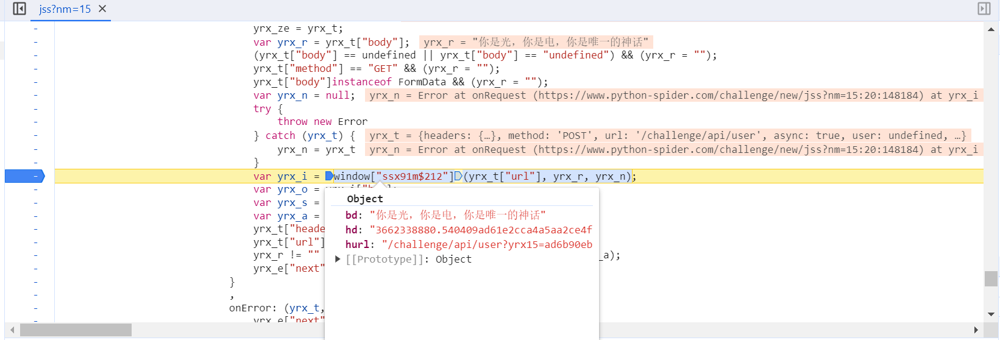

进入到函数后<font color=red>可以优先看下返回值，在返回值下断点</font>，当然也可以一步步跟下去

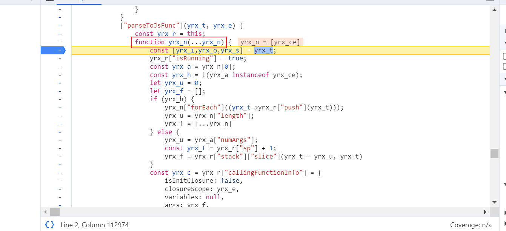

跟进这个函数，就能看见jsvmp代码了，

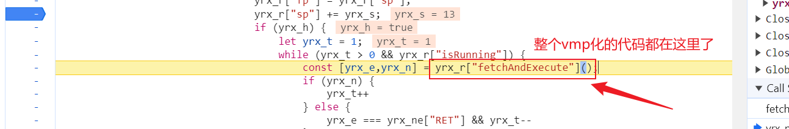

所有的指令集合操作都在这了。。。。。

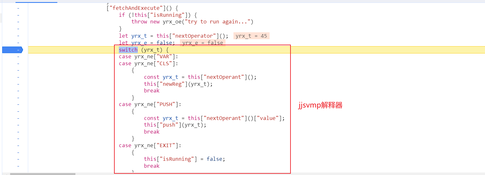

接下来我们就可以插入了，emmm.........当然是插桩了，怎么插？插到哪里最舒服？
可以在每一个指令的执行结果里面都去插桩但是这样的话流程会很麻烦不利于我们分析 ，所以【<font color=red>#插桩尽量插到明文</font>】
什么意思？就是某一个执行的指令返回的结果是明文，为什么？因为我们是**jsvmp补环境，主要目的就是找明文，找对象取值，找返回值** 

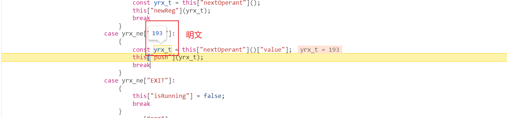

找到明文的位置，进入到`this["nextOperant"]()`这个函数里边找返回值进行插桩。。。

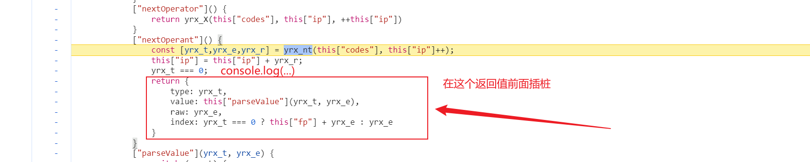

**当一个代码的位置频繁执行的时候(控制流平坦化 switch\if)就是我们关注的点，常规操作是在浏览器插入日志断点，逻辑走到日志断点处会优先执行日志打印到控制台，由于我们用了Fiddler的响应拦截器，我们对源码进行改动一下方便我们打印日志(插桩)，注意能不格式化尽量不要格式化，可能有格式化检测避免不必要的麻烦 。**
插桩的日志看到这里就可以了，后面的日志就不用再关注了，之前的日志全部是有效信息，将日志做下处理保存到本地文件
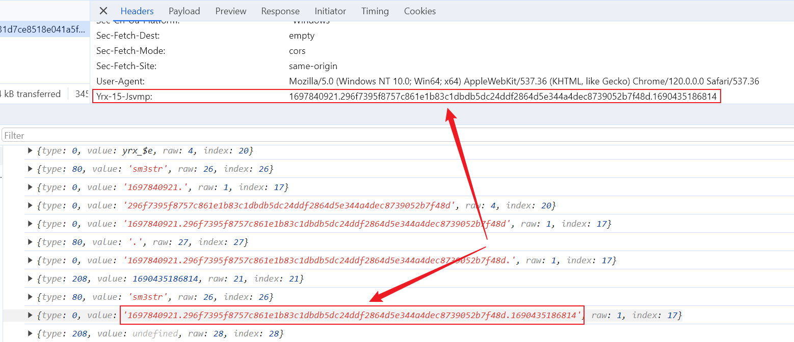

### 4)快速处理jsvmp补环境关键点

> <font color=red>浏览器本地联调，文本相似度对比</font>

Node运行本地js文件(注意: 代码需要稍微做下处理，做一个异常捕获)，执行命令`node --inspect-brk 'js文件'`，借助浏览器本地调试，然后单步走，到这里停下

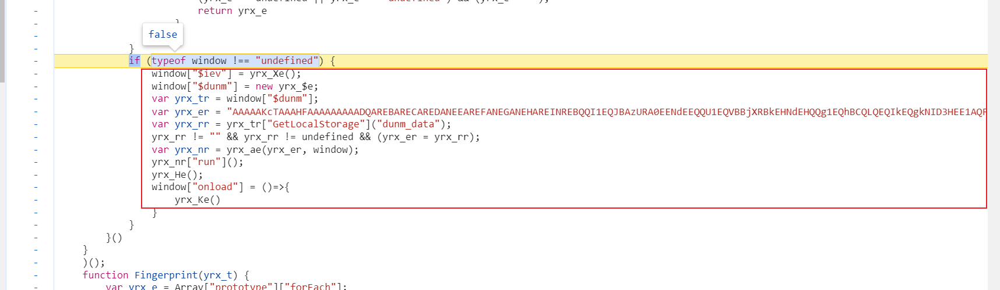

本地是没有这个window的，所以这个逻辑就不会进到if里面去，处理方案：
​	1.在本地先简单补一下window
​	2.再看下捕获的异常日志

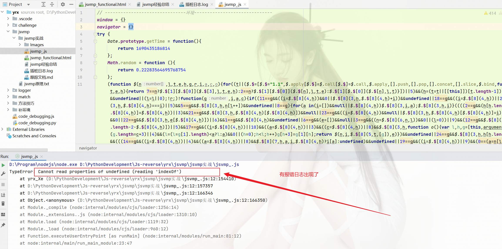
浏览器本地调试可以看到有插桩日志打印出来为止，然后将日志同样处理下保存到本地文件。。。

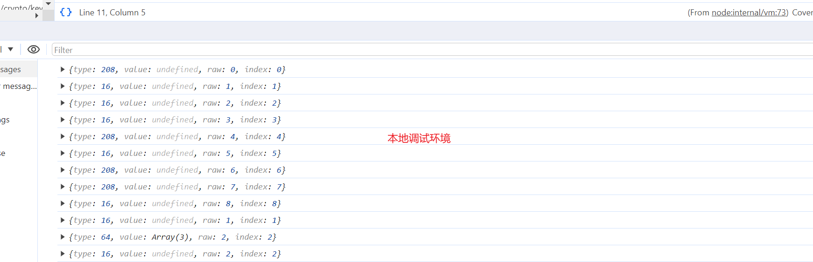

​	3.开始补环境，一定一定要借助浏览器的环境(网站的真实环境)

利用文本对比工具，将浏览器插桩日志和浏览器本地(本地调试)插桩日志进行对比，可以看到本地执行的堆栈和浏览器的堆栈几乎是一样的，可能有区别的是我们看不到数组里面的值
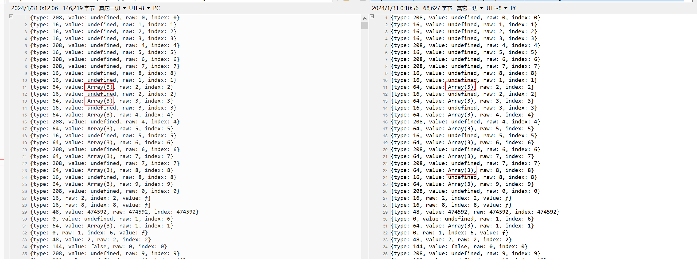

进行差异化对比到这里发现了异常，可以确定的是浏览器本地插桩的日志前面初始化代码都没问题，但到这里就停了。。。
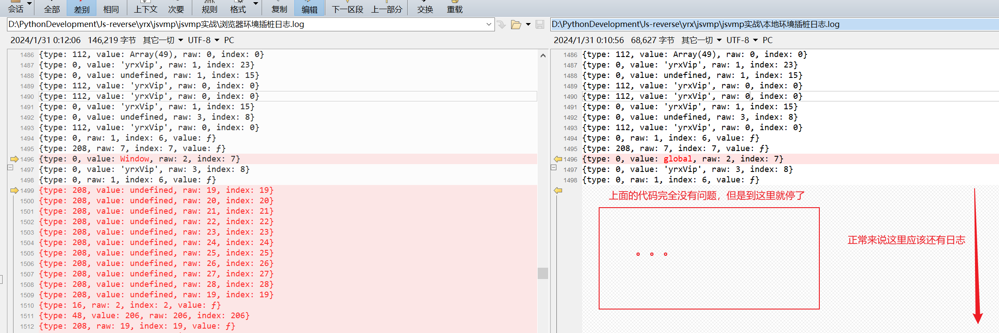

停了的原因是什么？为什么出现这种情况，原因可能是代码没有执行完， 本地没有发起XMLHttprequest请求导致的(可以进行验证?)，改下本地代码让它发起请求，
然后在本地执行发现有异常抛出，
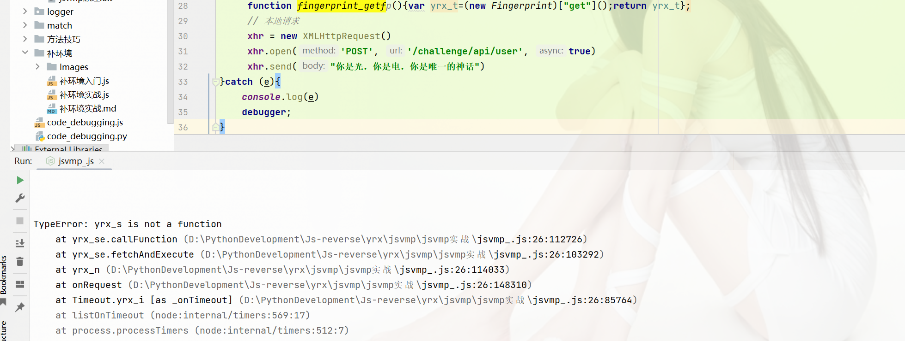

浏览器本地调试跟下堆栈，发现没有报错只有日志

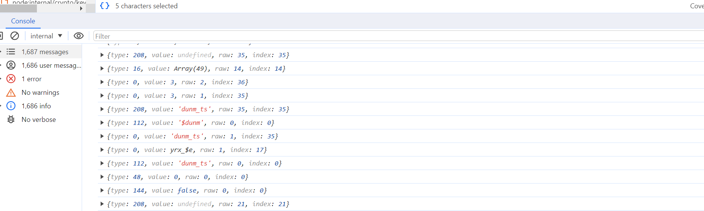

说明本地执行和浏览器本地调试还是存在一定差异。。。怎么办，，，尬住了，只能通过日志分析，
先看下之前浏览器本地插桩的日志的行数，再把这次浏览器本地调试的日志更新到之前的文件中，然后再次使用文档对比工具，发现又又又被截停了，
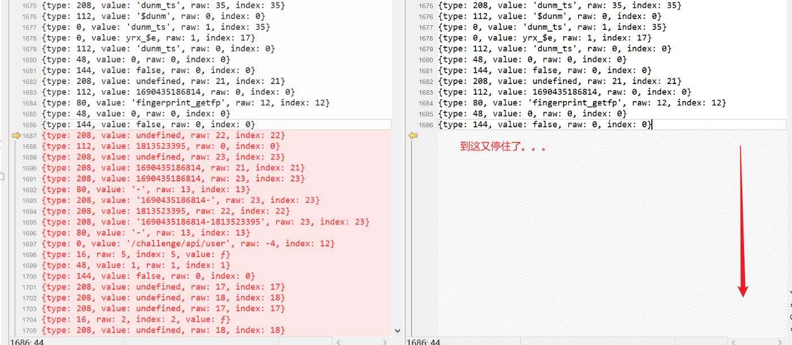

看截停的原因，从下向上看，最开始最显眼的地方，也就是这个 'fingerprint_getfp'，首先在明文中查看'fingerprint_getfp'是什么，

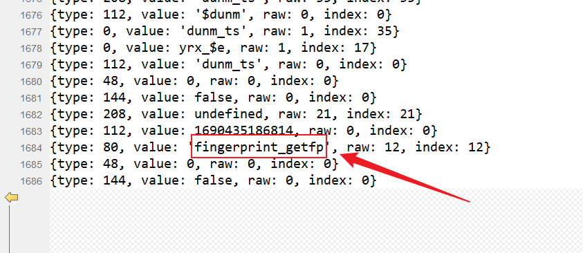

可以看到它是一个函数名字，代表着它正常应该执行了这个函数，看堆栈抛出的异常再结合浏览器本地插桩的日志，猜测这个函数可能没有找到
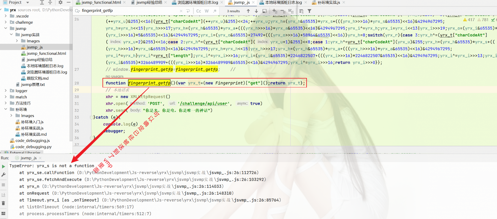

 函数没有被找到，为什么没有被找到？确认是不是变量作用域的问题，尝试把函数放到全局试试，这个时候就发现报错变了，可以确定就是变量作用域的原因，为什么会出现这种情况？(不知)
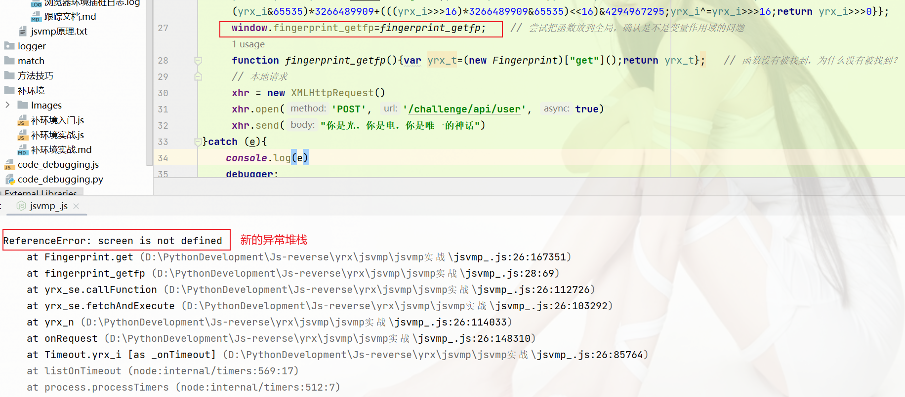

补完环境之后，结果就出来了，然后对比下浏览器环境的参数，结果不匹配，出现了蜜罐。。。
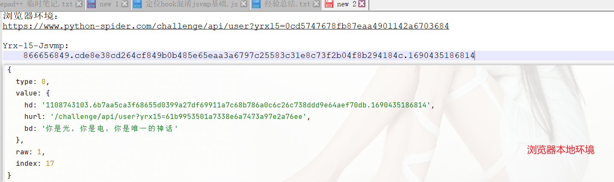

jsvmp处理蜜罐的方式，通过浏览器调试和浏览器本地调试的插桩日志进行对比，不同的地方就是埋的蜜罐。

计算的流程是一样的，但是值不一样，从上向下看插桩日志找第一次出现差异的地方，再向前找明文出现的地方，是之前作用域手动绑定到全局的那个函数，进入函数下断点，

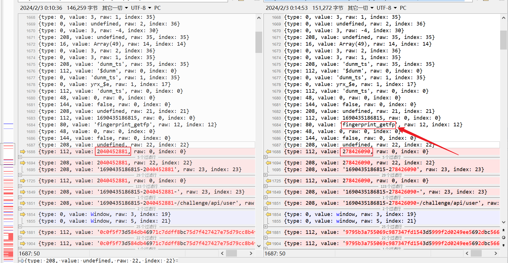

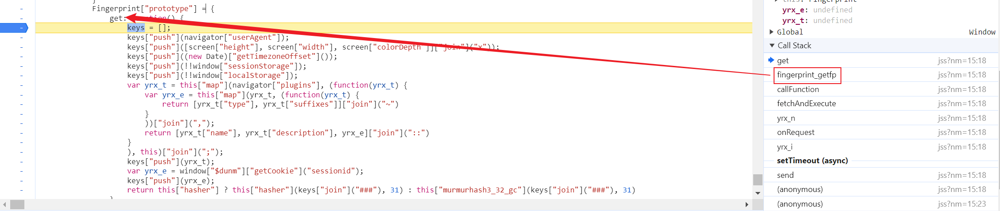

接着吭哧吭哧补环境，注意`localStorage`这个点，其它的都没什么。。。
```js
class localStorageMock {
    constructor() {
        this.storage = {}
    };
    setItem(key, value) {
        this.storage[key] = value.toString();
    };
    getItem(key) {
        return this.storage[key] || null;
    }
}
window.localStorage = new localStorageMock();
window.sessionStorage = new localStorageMock();
```

补完之后出结果了，将插桩日志保存，再次进行对比，中间过程省略，，，

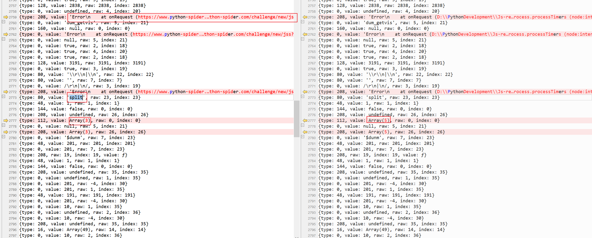

处理这个异常；

```js
Error = function (){}       // 原因是内置方法的现实原型不能被重写
Error.prototype.stack = 'Error\n    at eval (eval at onRequest (https://www.python-spider.com/challenge/new/jss?nm=15:3:148239), <anonymous>:1:2)\n    at onRequest (https://www.python-spider.com/challenge/new/jss?nm=15:18:148239)\n    at yrx_i (https://www.python-spider.com/challenge/new/jss?nm=15:18:85764)'
```

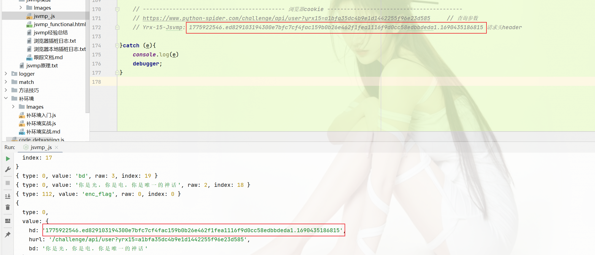

最终成功拿到值。

## 小插曲

过程中一定要心细，一气呵成避免重复无用的操作，浪费时间。。。     细心！细心！细心！【多思考】


