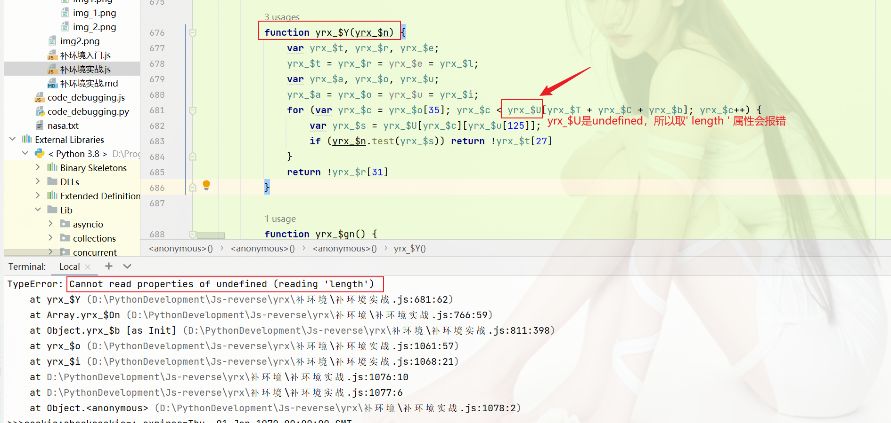
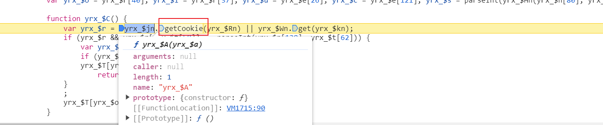

# 补环境入门

> **<font color=red size=4>目的是通过补环境生成cookie的 `yrx-13` 的值，不动任何代码</font>**

## 1.hook cookie
```
// hook cookie
var cookieVal = '';
Object.defineProperty(document, 'cookie', {
  set: function (a){
	debugger; cookieVal += a
  },
  get: function (){
	return cookieVal
  }
})
```

cookie的完整性, 意思就是说你设置cookie的时候, 原来的cookie不会被替换而是新增, 上面的hook cookie代码虽然hook到了值, 但是没有拿到我们想要的cookie值，断点继续向下，找到需要的cookie为止


## 2.找加密位置&源码分析
定位到这里，这个函数大概率就是我们需要的

注意这里的<font color=red>yrx_$T</font>是从哪里来的，


取<font color=red>yrx_$T</font>构造函数，**一般会通过原型链的方式获取**，`对象.constructor` 就可以拿到本对象的构造函数


找到构造函数之后，向上找堆栈，就会找到`new yrx_$i`的位置

到这基本上就结束了。。。

## 3.尝试补环境
> 不改变代码的情况下，将值拿到，让<font color=red>document.cookie</font>把值吐出来

在本地将代码原封不动的情况下，运行看结果，缺啥补啥。。。
根据网站实际逻辑走向分支，补相关环境

<font color=red>注意不要将值写死，我们是在补环境</font>

### 细节位置

本地环境执行:

网站环境:

网站搜索一下`yrx_$hn`是在哪里赋的值, 然后全部打上断点, 重新加载一下页面，跟着断点走看赋值的位置

<font color=red>补到本地运行不报错为止</font>

一切顺利的话，我们所需要的`document.cookie`就能在控制台打印出来，

很遗憾，什么都没有，这个时候我们就陷入了**蜜罐**的过程。

## 4.蜜罐
> 蜜罐: 由于我们的环境不足，导致了代码的走向发生了变化，没有按照预期的方向走
（出现了这种情况是最恶心的）

处理蜜罐的方法:
		笨方法: 浏览器和本地代码联调，单步走(可以是一个函数，可以是一段代码)       
		取巧方法: 蜜罐一定会存在条件分支，也就是本地的控制流走向和浏览器的代码控制流走向不一致就会出现条件分支
				出现分支的几种情况: 
					#1 判断 if...else
					#2 控制流平坦化 case...switch 
					#3 三目表达式 if:
					#4 异常捕获   try...catch  (*最先被排查出来)
					#5 逻辑运算符 &&、||

### 4.1 取巧方法

#### 1. try...catch

JS中存在一种情况，就是从对象里面取某个不存在的属性就会报错，
<font color=red>在所有的try...catch 分支，打印`catch`代码块捕获的`try`代码块抛出的值</font>，在本地运行js文件时又出现了报错。。。


由于本地看不到堆栈，所以本地node.js就得借用谷歌浏览器调试工具，`node --inspect-brk '要调试的js文件' `


可以向上多看几个位置，中间一部分过程省略。。。 走到这的时候就尬住了，值是undefined这尼玛怎么弄嘞



最后想了下，这个东西应该有赋值吧，是个数组或者字符串什么的，在浏览器环境下全局搜索下赋值的位置然后下断点看看，
后续补环境过程省略。。。
最终拿到cookie了，发现js执行并没有结束，**猜测可能有定时器任务执行。。。**

然后我们重写`setTimeout`、`setInterval`，可以<font color=red>打印下日志看下定时器(setInterval、setTimeout)执行的的第二个参数</font>，


可以看到`setInterval `定时器的执行时间是1200秒，相信自己的判断(已经和cookie没有关系了)，这个时候就大胆的置空就完事了，
然后校验cookie的有效性，拿到本地生成的cookie和浏览器环境去对比看是否一致，


很明显对不上，怎么办，祭出我们的分析大法。。。
记得前面通过源码分析的时候有一个数组`yrx_$T`，计算的时候它把所有的数据都搜集到这个数组里边再进行计算的


我们尝试把这个数组写死(用浏览器环境的值)，然后再与浏览器环境进行比较，查看cookie是否一致 

可以看到cookie值对上了，但由于我们是在补环境，所以不要在源码上进行任何改动。。。那怎么办，
我们还是得通过补环境的方式，让`yrx_$t`这个数组与我们写死的这个数组一致，
而`yrx_$t`是yrx_$T的一系列操作之后赋值得到的，所以我们的目标放在`yrx_$T`它身上 
**首先我们得让我们本地补环境的这个数组(<font color=red>`yrx_$T`</font>)与浏览器环境的数组进行一个联合调试，观察一下差别在哪里**


发现不一样地方，而yrx_$T是一个实例化对象，在它做new操作之后下断点再与浏览器环境对比下实例化之后的结果是否一致。。。
结合node调试工具与浏览器环境进行对比，看哪一步值发生了变化产生了异同，跟到这个 `yrx_$C` 函数之前本地环境和浏览器环境的值是一样的，


yrx_$C函数执行的时候，有一个获取cookie的分支, 在走这步之前我们**先把浏览器环境的cookie，localStorage清理掉(这一步很重要)**，否则的话分支流向可能就会改变


到这里发现这个值`yrx_$c`浏览器环境与本地环境的值不一样，全局搜一下，看看哪里有赋值(<font color=red>根据经验优先搜 `var yrx_$c` 字符</font>)


一个一个去看，定位到这里


然后补`localStorage` 环境。。。，走到这里的时候时候遇到一个循环，它会依次执行`yrx_$Sn`的所有函数，我们重点跟一下这里


**每补完一次`yrx_$T`的赋值，控制台打印下`yrx_$T`的值，确定一下浏览器环境和我们本地所补得环境的值是不是一致**，
这里。。。简单看下代码逻辑，就是for循环后依次执行函数，结果为true的时候返回


**有个技巧可以不用按顺序去全部跟这些函数，我们可以直接把断点下到返回值的位置，然后进到函数里面下断**


最后所有的环境补完，确定本地补环境生成的值与浏览器环境的值(cookie的值是固定的)一致即可。
