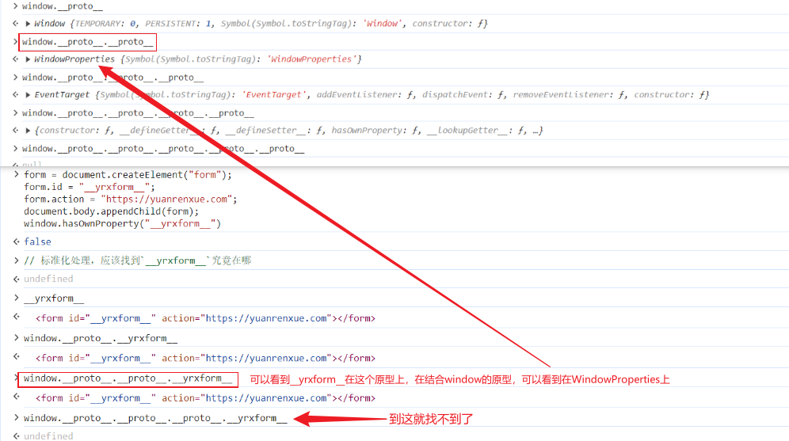

### 1. window.hasOwnProperty()



所以处理的标准的流程是应该修改`WindowProperties`

```javascript
// 让 WindowProperties.prototype 的 __yrxform__ 属性指向 -> form
// 这里需要注意的是，window.__proto__ 下是不是也可能存在 __yrxform__
// 可以使用这种方式 window.__proto__.__proto__.hasOwnProperty('__yrxform__') 可以准确的确认在哪个原型上
```

